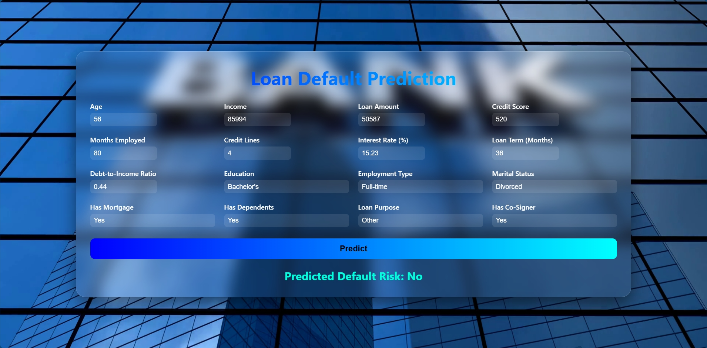

# **Loan Default Prediction System**

## 📘 Project Overview

Lending is a cornerstone of economic growth — it fuels entrepreneurship, empowers consumers, and drives business expansion. Yet, predicting which borrowers are likely to default remains one of the most difficult and high-impact problems in the financial industry. Even minor inaccuracies in credit risk assessment can lead to major losses, reduced liquidity, and systemic instability.

This project presents a **Machine Learning–driven Loan Default Prediction System**, developed to estimate the probability that a borrower will fail to repay a loan. The model integrates a variety of borrower and loan-related features such as income, credit score, employment type, debt-to-income ratio, loan amount, interest rate, and other behavioral and demographic factors.

By leveraging advanced classification algorithms, the system identifies hidden patterns in financial data that traditional methods often overlook. This fusion of **data science and financial analytics** demonstrates how artificial intelligence can make credit evaluation more accurate, transparent, and equitable. Beyond improving prediction performance, the project illustrates how AI can strengthen financial stability while promoting responsible lending practices.

---

## 🧠 Problem Context

Assessing loan default risk is a **high-stakes and highly imbalanced problem**. In most datasets, the number of borrowers who repay on time far exceeds those who default, creating a severe class imbalance. Standard machine learning models tend to focus on the majority class, which can result in missing the minority class — the very borrowers whose defaults can be costly for lenders.

Traditional approaches rely heavily on simplified indicators such as credit scores or debt ratios, which only partially capture the complex realities of borrower behavior. Borrower reliability is dynamic, influenced by income fluctuations, employment changes, market shifts, and personal circumstances. One-dimensional models often fail to capture these nuances, leading to misclassified risk profiles and inefficient lending portfolios.

This project addresses these challenges by applying **cost-sensitive learning**, where the model is explicitly penalized for misclassifying defaulters. By assigning higher weight to the default class, the Logistic Regression model focuses on correctly identifying high-risk borrowers. As a result, the system achieves a **recall of 1.0 on the test set**, successfully capturing all potential defaulters. This comes at a trade-off — other metrics such as precision, accuracy, and F1 are reduced — but this trade-off is intentional and aligns with the primary goal of **minimizing financial risk**.

By transforming raw financial data into meaningful insights, the model enables lenders to make faster, fairer, and more informed decisions, improving both risk management and financial inclusion.

---

## 💡 Motivation — Why This Project Matters

I chose to focus on **Loan Default Prediction** because it sits at the intersection of data science, finance, and social responsibility. Predictive modeling in credit risk assessment is both a technical and ethical challenge — balancing accuracy, fairness, and accessibility is crucial.

As a data science student, this project allowed me to apply machine learning to a **real-world, high-impact financial problem**. I implemented a complete predictive pipeline, including preprocessing, feature engineering, model training, and evaluation, while also tackling challenges like **class imbalance, overfitting, and interpretability**.

Applying cost-sensitive learning and prioritizing recall provided practical insight into **how models can be tailored to business priorities**. The experience reinforced how data-driven tools can support responsible lending — protecting institutions from loss while promoting fairness and transparency for borrowers.

---

## ⚠️ Disclaimer

The **Loan Default Prediction System** is an academic and exploratory project developed to understand how predictive analytics can be applied in finance. It is not a production-ready system and should not be used for actual lending or credit decisions. The dataset used is either synthetic or open-source, intended purely for demonstration and experimentation.

While the model demonstrates advanced machine learning techniques and cost-sensitive approaches to handle class imbalance, its outcomes are illustrative rather than definitive. This project highlights the potential of AI in **minimizing financial risk, reducing bias, and promoting inclusive access to credit**. It reflects a step toward **ethical, intelligent, and sustainable financial systems**, where human expertise and machine learning work together to create smarter, fairer lending environments.

---
